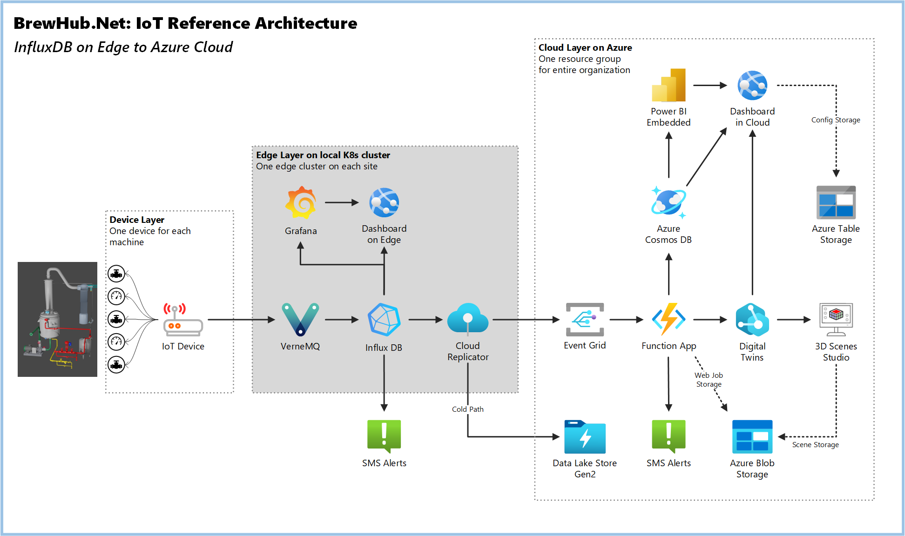
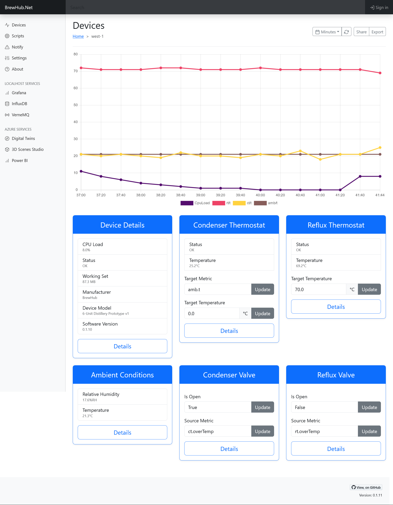

# BrewHub.Net: Multi-stack IoT Architecture

BrewHub.Net is an IoT reference architecture using .NET-based device software, InfluxDB and Grafana on a multi-node edge cluster, connected to Azure Services on the backend, with a Vue.JS dashboard for user monitoring and control.



| Layer | Purpose | Projects |
| -------- | ------- |  ------- |
| Devices | Compute devices connected to machinery, equipment or others. Drives sensors and actuators to sense or drive the attached equipment. May be connected directly, or through industrial control systems (e.g. PLCs) | [6-Unit Controller](https://github.com/jcoliz/BrewHub.Devices.Still6UnitController)
| Edge  | Multi-node edge cluster(s), located on-premises, connected to each device. Handles the 'hot path' of data as it immediately comes off devices. Provides key near-real-time insights and alerting. Cools the data slightly before sending a less-frequent and more-focused data representation to the cloud  | [Edge](https://github.com/jcoliz/BrewHub.Edge)
| Cloud   | Back-end services collect and reason over multiple sites, provide a big-picture view and wide-scope control plane. | Coming soon!
| Dashboard | Gives users a single pane of glass to monitor, configure, control, and gain insights about their system. Can run cloud-side to look across an entire operation, or on the edge to give a low-latency view into a single site. | [Dashboard](https://github.com/jcoliz/BrewHub.Dashboard)

## What's Here: BrewHub.Net Edge Stack

This repository defines a docker composition which runs on the edge device, communicating with leaf devices on the same network. Ultimately this will be a Kubernetes configuration. For now, it's here as a simple docker composition for prototyping.

## Getting Started

The `docker compose` file demonstrates the edge stack on a single machine. To get started quickly, you can additionally bring up synthetic controllers for demo purposes to have data to look at.

```
$ docker compose -f docker-compose.yml -f docker-compose-controllers.yml up -d
```

Have a view of everything

```
$ docker ps --format 'table {{ .ID }}\t{{.Image}}\t{{ .Names }}\t{{ .Status }}'

CONTAINER ID   IMAGE                                              NAMES                         STATUS
24488a72e69d   jcoliz/brewhub-still6unit-controller:0.0.0-amd64   brewhub-edge-controller-1-1   Up 4 hours
170a1fbd0bcc   jcoliz/brewhub-still6unit-controller:0.0.0-amd64   brewhub-edge-controller-2-1   Up 4 hours
0f714daa31d1   jcoliz/brewhub-dashboard:0.0.2-amd64               dashboard                     Up 4 hours (healthy)
aec2de903354   jcoliz/brewhub-still6unit-controller:0.0.0-amd64   brewhub-edge-controller-3-1   Up 4 hours
f1c81a1f9616   telegraf:1.26.3-alpine                             telegraf                      Up 9 hours
f390c1cde46d   grafana/grafana:9.5.2                              grafana                       Up 9 hours
715334c7cd25   vernemq/vernemq:1.12.6.2                           vernemq                       Up 9 hours (healthy)
91d47b336006   influxdb:2.7.1-alpine                              influxdb                      Up 9 hours (healthy)
```

## View the Dashboard on `localhost:80`

Bring up http://localhost:80 in your browser to connect with the local instance of the [BrewHub.Net Dashboard](https://github.com/jcoliz/BrewHub.Dashboard).


